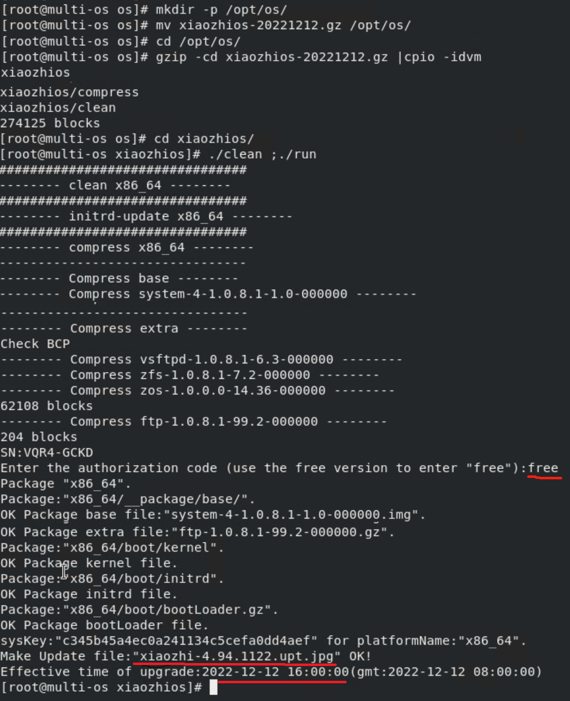
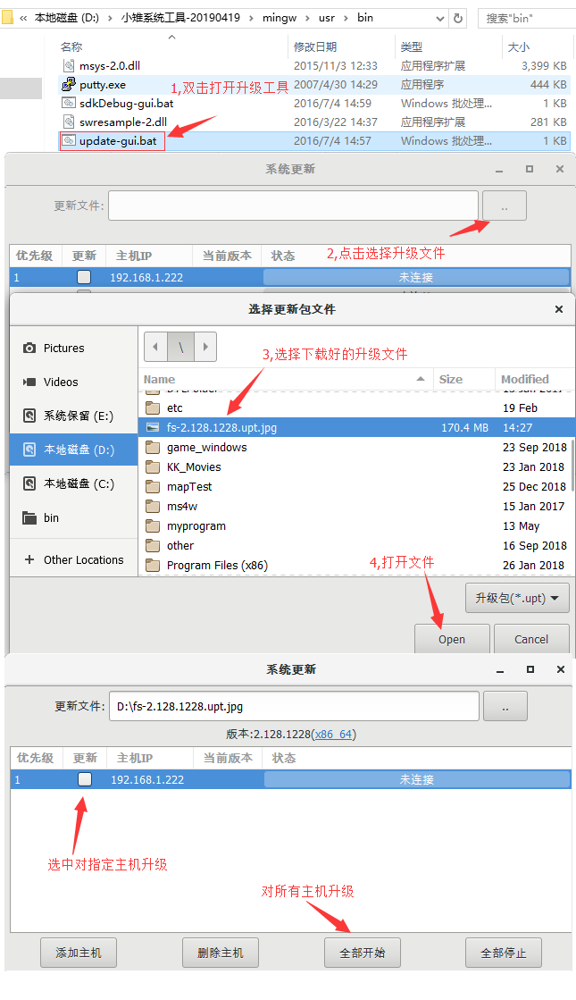
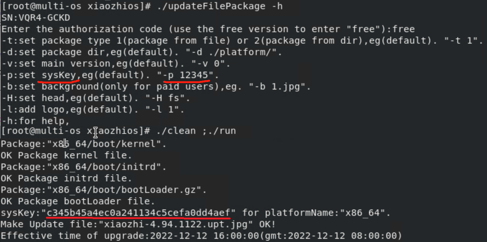
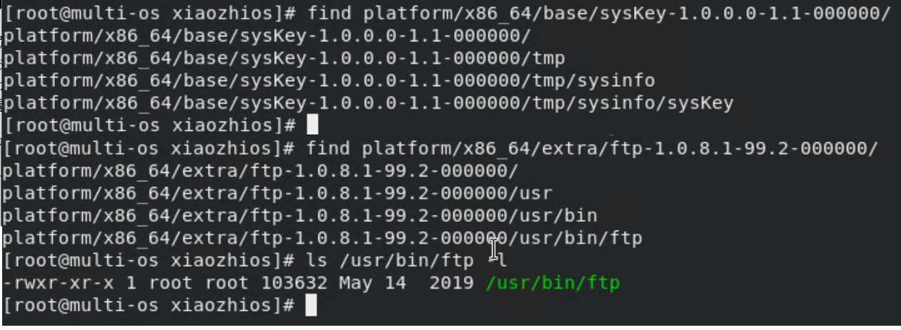

# 小雉系统

#### 项目地址
官网     http://www.feitianzhi.com/  
github  https://github.com/feitianzhi/xiaozhios  
gitee   https://gitee.com/feitianzhi/xiaozhios   
QQ交流群：[869598376](http://www.feitianzhi.com/ "小雉系统") 
 
#### **小雉系统简介**
------

“小雉系统”并非是开发操作系统,而是一套服务于软件供应商的产品升级方案;  

#### **需求分析**
------
&nbsp;&nbsp;&nbsp;&nbsp;&nbsp;&nbsp;软件一般都运行在操作系统中,软件的运行依赖系统库、驱动，在实际项目中往往遇到以下问题：

 1. 新版本的软件需要兼容项目上所有运行的系统（如ubuntu 16.04、ubuntu 18.04、centos6、centos7、centos8等），否则无法同步给所有客户或是需要打分支为每一个版本的系统单独编译测试；
 2. 早期项目选定一个系统（centos5）可满足所有需求,而centos5不包含新硬件（以前的硬件可能停产，且新硬件的性能更好价格更便宜）的驱动，而为centos5添加硬件驱动的难度（如新驱动必须要4.*以上的内核）成本都非常高昂，最终只能采用centos8系统，这时需要所有的centos5的机器全部重新部署centos8或是软件增加分支同时维护centos5和centos8的版本；
 3. 实验室测试效果与项目运行结果不一致，比如指定ubuntu18.04为开发及运行环境，而系统安装好后需要增加额外的软件，apt 可能从某云拉取软件包进行安装，但因时间问题拉取到的数据可能不一致（某云的软件仓库在更新，其次不掌握在自己手中的数据怎么谈一样，即使知道不一样打印一句日志问题也没有消失），导致实验室和项目上的系统有差异，最终导致软件运行结果不一致；
 4. 从源码自己编译与维护一套系统可以保证实验室与项目系统完全一致，但必须解决驱动适配，硬件测试的问题，其难度大，成本甚至比您要开发的应用程序成本还高；

#### **思考与假设**
------
&nbsp;&nbsp;&nbsp;&nbsp;&nbsp;&nbsp;我是一名应用开发者，我希望使用新系统--学习新技术，希望可以选择合适的系统（比如某合作单位提供的库是ubuntu18.04编译的，而选centos6系统作为生产环境）要求方案具备如下特性：

 1. 现场与实验室的系统完全一样，包括内核、驱动、虚根、库、文件系统、日志数据（每次系统启动时，所有机器的日志及临时文件也相同，保证启动时绝对可以正常运行）；
 2. 应用开发完成后只需要在开发环境中测试，不需要在各个生产环境中测试（过多的生产环境增加测试成本，测试人员增多，增加沟通成本）；
 3. 开发环境的系统可以随意修改（比如可以更换内核、增加驱动、修个核心库版本、甚至直接跟换系统发行版本把ubuntu18.04更换成cnetos8.1),生产环境可以自动安全无差别的同步为和开发环境一致的系统；
 4. 系统可以退回历史的任意版本，N年前的项目现升级最新系统后有功能异常了，需要立即退回原来版本已恢复生产环境，实验室也可恢复到项目的历史版本进行测试；

#### **抽象与总结**
------

 1. 系统可以来自任意发行版本，要让系统遵循某一规则是不可能的，方案必须兼容所有系统的规则；
 2. 系统可以升级与降级，且升级与降级可以跨越版本，则要求方案与版本无关，版本无连续性要求；
 3. 系统启动后日志及临时文件相同，则要求系统启动时可以自还原为初始状态；
 4. 系统升级需要安全及完全的一致性，则要求方案具备断电保护机制与数据校验机制；

#### **小雉系统设计**
------
 - “小雉系统”采用事务性更新  
&nbsp;&nbsp;&nbsp;&nbsp;&nbsp;&nbsp;在系统中含有两个root filesystem分区：A区及B区(各含有一个系统image)。当A区启动后，它可以用来更新B区。只有B区更新完整后才可以切换过来到B区，否则永远处于A区。反之亦然，我们可以用同样的办法来更新A区。这对很多需要稳定工作的环境的系统来说非常重要，比如更新一个远在路口的webcam。
 - 更强的应用安全    
&nbsp;&nbsp;&nbsp;&nbsp;&nbsp;&nbsp;系统image只是可读的，任何应用不可以更改它。这样的好处是不至于由于某个应用的bug导致整个系统重启后不能恢复，保证系统重启后绝对正常运行。系统的只读特性让系统每次启动都会恢复到初始状态，保证重启大法的绝对有效。
 - 更随意的软件测试     
&nbsp;&nbsp;&nbsp;&nbsp;&nbsp;&nbsp;系统内的所有软件都具有完整的控制权限，可以任意更改和删除文件系统中的数据，在重启后都会恢复为系统image，适合做对操作系统有破坏的测试。
 - 带权限的软件包设计     
&nbsp;&nbsp;&nbsp;&nbsp;&nbsp;&nbsp;系统软件包设计权限位，实现一个升级包可用于多客户。

#### **小雉系统使用**
------

1. 下载开源系统镜像（xiaozhios-vmware.zip）：http://www.mym9.com:16080/files/xiaozhios-vmware.zip    
&nbsp;&nbsp;&nbsp;&nbsp;&nbsp;&nbsp;开源镜像是使用其中一个版本的升级包制作的vmware镜像（用户名：root，密码：12345），在此版本上应用升级包即可把系统升级或降级为升级包中的系统； 
&nbsp;&nbsp;&nbsp;&nbsp;&nbsp;&nbsp;开源镜像启动后需要配置ip,ip配置方法(工具最新版本：http://www.mym9.com:16080/files/tools.zip)：http://www.feitianzhi.com/boke/index.php/archives/15/  
&nbsp;&nbsp;&nbsp;&nbsp;&nbsp;&nbsp;从镜像中制作系统安装包的方法： http://www.feitianzhi.com/boke/index.php/archives/50/   
&nbsp;&nbsp;&nbsp;&nbsp;&nbsp;&nbsp;使用镜像安装到云服务器（也适用于物理机）的方法： http://www.feitianzhi.com/boke/index.php/archives/11/  

2. 下载升级包源码    
>&nbsp;&nbsp;&nbsp;&nbsp;&nbsp;&nbsp;升级包源码为cpio.gz压缩包，解压方法：gzid -cd xiaozhios-20221212.gz |cpio -idvm    
>&nbsp;&nbsp;&nbsp;&nbsp;&nbsp;&nbsp;升级包源码源码，最新版本(http://www.mym9.com:16080/files/xiaozhios-openSource.gz):   
>&nbsp;&nbsp;&nbsp;&nbsp;&nbsp;&nbsp;历史版本:2022-12-12 https://download.csdn.net/download/zhangrui_fslib_org/87269355   
>&nbsp;&nbsp;&nbsp;&nbsp;&nbsp;&nbsp;&nbsp;&nbsp;&nbsp;&nbsp;&nbsp;&nbsp;初始化版本；    
>
>&nbsp;&nbsp;&nbsp;&nbsp;&nbsp;&nbsp;制作升级包的方法（制作好后使用升级工具升级即可，升级包中的定制见下节）:   
>    
    mkdir -p /opt/os
    cd /opt/os
    //mv xiaozhios-20221212.gz /opt/os/xiaozhios-openSource.gz
    wget -o xiaozhios-openSource.gz http://www.mym9.com:16080/files/xiaozhios-openSource.gz
    gzid -cd xiaozhios-openSource.gz |cpio -idvm
    cd xiaozhios
    ./clean;./run
  生成升级包（如xiaozhi-4.94.1122.upt.jpg)后，把升级包拷贝到windows下，使用下级的工具升级
  
  
3. 下载升级工具(工具最新版本：http://www.mym9.com:16080/files/tools.zip)：http://www.feitianzhi.com/boke/index.php/ziyuanxiazai.html    
&nbsp;&nbsp;&nbsp;&nbsp;&nbsp;&nbsp;升级工具是“小雉系统工具”包中的一个小工具，使用方法可以参考: http://www.feitianzhi.com/boke/index.php/archives/14/        

#### **小雉系统升级包源码定制**
------

1. xiaozhios/clean：清理制作升级包时产生的临时文件及升级包；    
2. xiaozhios/run：制作升级包的脚本（此脚本要求输入授权码，开源用户输入free）； 
3. xiaozhios/updateFilePackage：打包工具，在run脚本中调用，此工具可以设置密码（默认为12345）,生成的升级包会显示系统的sysKey，升级包在升级时会校验sysKey,不匹配则不能升级，即各用户可以使用不同的密码使自己做出的系统只能应用到自己的系统中；

4. xiaozhios/platform/x86_64：储存x86_64系统的目录（platform下可以储存多个系统，即可以把多个系统做在一个升级包中）；
5. xiaozhios/platform/x86_64/mask.txt：系统包掩码的定义，升级包按如下规则应用掩码
> 假设系统掩码为m,包掩码为b:    
&nbsp;&nbsp;&nbsp;&nbsp;&nbsp;&nbsp;最高位-表示掩码校验方式(0-表示(m&(b&0x5FFFFF))==(b&0x5FFFFF)时包被需要,1-表示(m&(b&0x5FFFFF))!=0时包被需要);    
&nbsp;&nbsp;&nbsp;&nbsp;&nbsp;&nbsp;次高位-表示包除按标准方式校验外,如(m&b&0x400000)|((m|b)&0x200000)==0x400000时,包需要进行额外的头判断(即包的前缀与系统的前缀相同);    
&nbsp;&nbsp;&nbsp;&nbsp;&nbsp;&nbsp;次次高位-强制包的额外头判断恒为真，如(m|b)&0x200000!=0,则包的额外头判断结果为真;  
6. xiaozhios/platform/x86_64/boot：存放kernel、initrd及引导；    
7. xiaozhios/platform/x86_64/base：存放基础软件包，该目录中的软件包是一次性解压后再启动；   
8. xiaozhios/platform/x86_64/extra：存放扩展软件包，在基础软件包解压并启动系统后，再逐个解压进行启动；  
9. 软件包的命名规则,例如zfs-1.0.8.1-7.2-000000    
> &nbsp;&nbsp;&nbsp;&nbsp;&nbsp;&nbsp;000000:表示权限信息(系统掩码为m,包掩码为b)    
            &nbsp;&nbsp;&nbsp;&nbsp;&nbsp;&nbsp;&nbsp;&nbsp;&nbsp;&nbsp;&nbsp;&nbsp;最高位-表示掩码校验方式(0-表示(m&(b&0x5FFFFF))==(b&0x5FFFFF)时包被需要,1-表示(m&(b&0x5FFFFF))!=0时包被需要)    
            &nbsp;&nbsp;&nbsp;&nbsp;&nbsp;&nbsp;&nbsp;&nbsp;&nbsp;&nbsp;&nbsp;&nbsp;次高位-表示包除按标准方式校验外,如(m&b&0x400000)|((m|b)&0x200000)==0x400000时,包需要进行额外的头判断(即包的前缀与系统的前缀相同)    
            &nbsp;&nbsp;&nbsp;&nbsp;&nbsp;&nbsp;&nbsp;&nbsp;&nbsp;&nbsp;&nbsp;&nbsp;次次高位-强制包的额外头判断恒为真，如(m|b)&0x200000!=0,则包的额外头判断结果为真    
        &nbsp;&nbsp;&nbsp;&nbsp;&nbsp;&nbsp;2:表示第二个版本,升级包的版本号是所有包此值的和    
        &nbsp;&nbsp;&nbsp;&nbsp;&nbsp;&nbsp;7:包的序号,序号小的先解压先启动,序号相同时按名称逆序排序    
        &nbsp;&nbsp;&nbsp;&nbsp;&nbsp;&nbsp;8.1:表示基于8.1系统制作   
        &nbsp;&nbsp;&nbsp;&nbsp;&nbsp;&nbsp;1.0:表示程序的主版本号为1.0 
10. 软件包内部结构，该方案要求软件包内的文件名及目录名不能以"__"打头，内部建议按原版本系统组织（即直接拷贝原系统中文件按原系统目录结构储存）   
>      
sysKey软件包在/tmp/sysinfo/sysKey文件存放的数据为制作升级包时生成的sysKey数据："c345b45a4ec0a241134c5cefa0dd4aef"
ftp软件包是拷贝原版系统的ftp文件做的一个软件包
